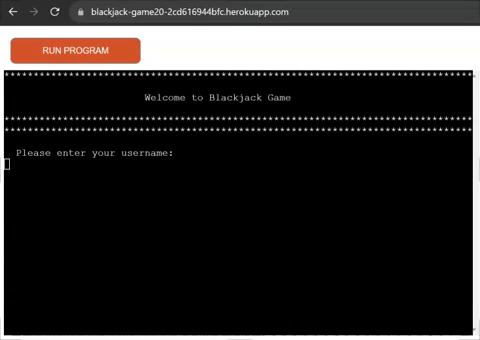
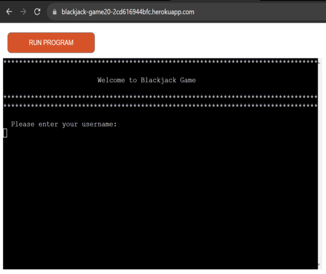
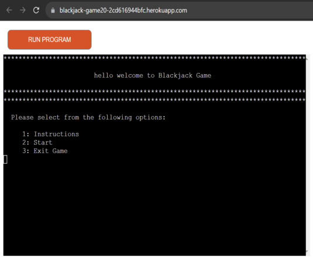
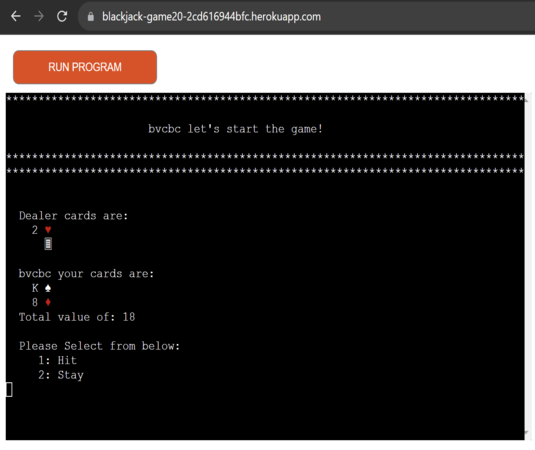
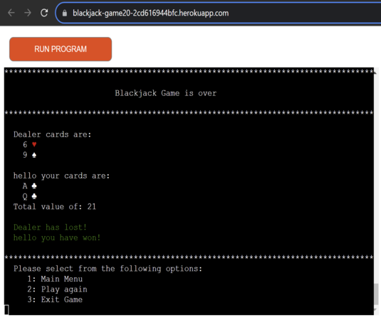
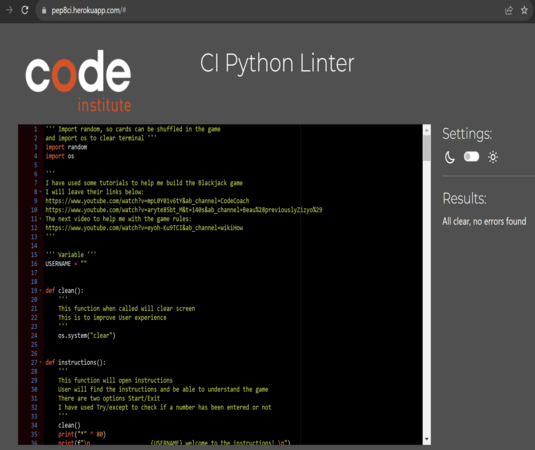
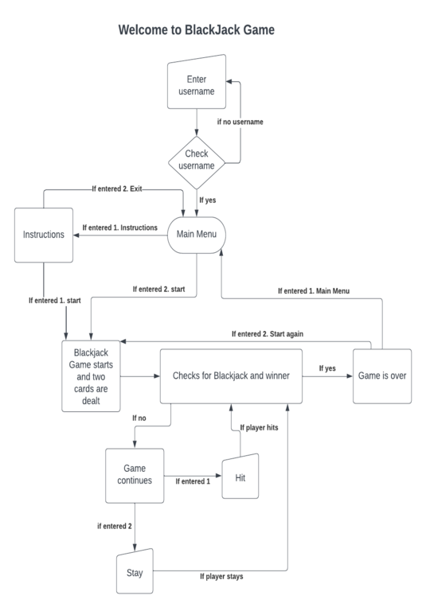

# **BlackJack Game**

## This is a [Blackjack game](),

<p> This is a Blackjack game and is targeted for anyone that may want to challenge the dealer
<p> The objective here is to beat the dealer
<p> By obtaining 21 points or as close as possible to it
<p> If you get more than 21 points, you bust.
<br>



---

## **Content**

- [**BlackJack Game**](#blackjack-game)
  - [User Experience](#user-experience)
  - [Design](#design)
    - [Typography](#typography)
    - [Features](#features)
      - [Game]()
  - [Programs and tools used](#programs-and-tools-used)
  - [Languages](#languages)
    - [Python](#python)  
  - [Flow Chart](#flow-chart)
  - [Accessibility](#accessibility)
    - [Lighthouse](#lighthouse)
      - [Desktop Page](#desktop-page)
      - [Mobile Page](#mobile-page)  
  - [Testing](#testing)
  - [Bugs](#bugs) 
  - [Deployment](#deployment)
  - [Credits](#credits)
    - [Content](#content-1)
    - [Media](#media)  
  - [Acknowledgments](#acknowledgments)  

---

## **User Experience**

Visitors:

- Users will be presented with a Blackjack game, which is running on Heroku
- The instructions are provided to help understand the game
- Colours have been added to help distinguish the winner and loser

Goals:

- The player will have to beat the dealer in order to win
- You are suppose to have a BLackjack = 21 points or to have as close as possible to 21 points to beat the dealer
- If you lose play again to beat the dealer
- The main goal is to have fun :)

The game:

- Starting at the beginning with a page asking you to type your username
- After entering your username, it will take you to a main menu with two options:
    - INSTRUCTIONS -  to take you to the instructions menu
    - START - to start the Blackjack game  
- If you select the instructions it will take you to another menu where instructions are displayed and two options to select:
    - START - to start the game
    - EXIT - to take you back to main menu  
- Once you start the game the dealer will give you and himself two cards, the second card from the dealer will be hidden until the game is over
- The gamne will check for Blackjacks, if there is no Blackjack the game will continue
- Two options will be displayed:
    - HIT - to request another card
    - STAY - to check results
- If you have selected Hit, the game will check for winners, if there is no winner the two options will be displayed again
- If you select Stay, the game will check for winners.
- Once the game is over two options will appear:
    - MAIN MENU - to take you back to main menu
    - PLAY AGAIN - to start a new game :)

[Back to the top](#blackjack-game)

---

## **Design**

### Typography

Colours used:

- Colours used are GREEN and RED, they were imported from colorama
```
import colorama
from colorama import Fore
colorama.init(autoreset=True)
```
- In order to work had to install colorama and freeze requirements.txt
```
pip3 install colorama
```
```
pip3 freeze > requirements.txt
```

<br>

[Back to the top](#blackjack-game)

---

### Features


- #### Username Container

    - Welcome message displayed to the player
    - Username requested in order to progress
      <br>

      

- #### Main Menu Container

    - Welcome message displayed to the player
    - Two options displayed for the user to select
        - Instructions
        - Start
      <br>

      

- #### Instructions Container

    - Instructions displayed for the player to help understand the game
    - Two options displayed for the user to select
        - Start
        - Exit
      <br>

      

- #### Blackjack game Container

    - The game starts and two cards are given to the player and dealer
    - Two options displayed for the user to select
        - Hit
        - Stay
      <br>

      

- #### Game is Over Container

    - Once the game is over, the winner is annouced
    - Two options displayed for the user to select
        - Main Menu
        - Play Again
      <br>

      

 

[Back to the top](#blackjack-game)

---

## Programs and tools used

- [Codeanywhere](https://app.codeanywhere.com/) - To create the website.
- [Github](https://github.com/) - Where the website is stored.
- [Am I Responsive?](https://ui.dev/amiresponsive) - To display the website on different websites.
- [Spell Check](https://chrome.google.com/webstore/detail/webpage-spell-check/mgdhaoimpabdhmacaclbbjddhngchjik/related) - To check spelling.
- [Google Tools](https://developer.chrome.com/docs/devtools/) - to check website styling and responsiveness.
- [Gyazo](https://gyazo.com/) - To take Screenshots.
- [CI Python Linter](https://pep8ci.herokuapp.com/#) - To check for python code errors

[Back to the top](#blackjack-game)

---

## Languages

- ### Python

    - Python code passes with no errors when checked on CI Python Linter
        - run.py page - PASS  
      <br>

      
      <br>  


[Back to the top](#blackjack-game)

---

## Flow Chart

- To help me with the logic and to create the game I have used [Lucidchart](https://www.lucidchart.com/) to create a flow chart.  
    <br>

    
    <br>  


[Back to the top](#blackjack-game)

---

## Testing

- The Blackjack game has been tested and it works on different types of computers with different browsers:
  - Chrome
  - Safari
  - Microsoft Edge
  - Firefox
- It has been tested and work on different mobile phone brands:
  - Realme x2
  - Xiaomi note 8
  - Hauwei p30 lite
  - Poco F5 pro
- Tests were carry out by myself, friends and family, different devices from PCs, laptops, tablets to mobile phones.
- All functions work as they should.
 <br>

[Back to the top](#blackjack-game)

---

### Username

| Feature | Expected Outcome | Testing | Result | Pass or Fail |
| --- | --- | --- | --- | --- |
| Title | Welcome message to the player | App started | Welcome message displayed | pass |
| Input | For user to enter username | numbers entered | 'Only letters accepted' message displayed | pass |
| Input | For user to enter username | blank spaces entered | 'Please enter username in order to proceed' message displayed | pass |
| Input | For user to enter username | username entered | value taken and Main Menu shown | pass |

 <br>

 ### Main Menu

| Feature | Expected Outcome | Testing | Result | Pass or Fail |
| --- | --- | --- | --- | --- |
| Title | Welcome message to the player | username entered | Welcome message with username in it displayed | pass |
| Input | For user to type number 1 or 2 option | number 5 entered | 'Please select a number from the options:' message displayed | pass |
| Input | For user to type number 1 or 2 option | Blank spaces entered | 'Invalid Input Entered' message displayed | pass |
| Input | For user to type number 1 or 2 option | letters entered | 'Invalid Input Entered' message displayed | pass |
| Input | For user to type number 1 Instructions option | option 1 entered | value taken and Instructions shown | pass |
| Input | For user to type number 2 Start option | option 2 entered | value taken and Game started | pass |

 <br>

  ### Instructions

| Feature | Expected Outcome | Testing | Result | Pass or Fail |
| --- | --- | --- | --- | --- |
| Title | Welcome to instructions message to the player | Openned instructions | Welcome to instructions message with username in it displayed | pass |
| Instructions | To display instructions for the player | Openned instructions | Instructions displayed | pass |
| Input | For user to type number 1 or 2 option | number 5 entered | 'Please select a number from the options:' message displayed | pass |
| Input | For user to type number 1 or 2 option | Blank spaces entered | 'Invalid Input Entered' message displayed | pass |
| Input | For user to type number 1 or 2 option | letters entered | 'Invalid Input Entered' message displayed | pass |
| Input | For user to type number 1 option | option 1 entered | value taken and Game started | pass |
| Input | For user to type number 2 option | option 2 entered | value taken and Main menu shown | pass |

 <br>

   ### Blackjack game

| Feature | Expected Outcome | Testing | Result | Pass or Fail |
| --- | --- | --- | --- | --- |
| Title | Blackjack Game message | Start the game | Message displayed | pass |
| Dealer cards | two cards given | Start the game | Dealer cards displayed | pass |
| Dealer card number 2 | Second card hidden | Start the game | Second card hidden | pass |
| Player cards | two cards given | Start the game | Player cards displayed | pass |
| Input | For user to type number 1 or 2 option | number 5 entered | 'Please select a number from the options:' message displayed | pass |
| Input | For user to type number 1 or 2 option | Blank spaces entered | 'Invalid Input Entered' message displayed | pass |
| Input | For user to type number 1 or 2 option | letters entered | 'Invalid Input Entered' message displayed | pass |
| Input | For user to type number 1 option | option 1 entered | value taken and and another card displayed | pass |
| Input | For user to type number 2 option | option 2 entered | value taken and check results | pass |
| End game | Game is over message | Running the game till it finishes | Game is over message displayed | pass |
| Check winner | winner message | After the game is over | message with winner displayed | pass |
| Input | For user to type number 1 or 2 option | number 5 entered | 'Please select a number from the options:' message displayed | pass |
| Input | For user to type number 1 or 2 option | Blank spaces entered | 'Invalid Input Entered' message displayed | pass |
| Input | For user to type number 1 or 2 option | letters entered | 'Invalid Input Entered' message displayed | pass |
| Input | For user to type number 1 Main menu option | option 1 entered | value taken and go back to main menu | pass |
| Input | For user to type number 2 Start again option | option 2 entered | value taken and Start the game again | pass |

 <br>

[Back to the top](#blackjack-game)

---

## Bugs

- The game had a bug at the end where the score was being shown, the winner/loser message was being displayed duplicate
    - I have moved the ```self.winnerCheck(cardDealerHand, userHand, gameOver=True)``` to after of the loop
- 
    - 
- 
  - 
- 
  - 
  <br>

[Back to the top](#blackjack-game)

---
 
## Deployment

### My Deployment

- The website was deployed to Github pages. Steps to deploy:  

1. Open Github
2. Log in into your Github account. 
3. In the Github repository select the project. 
4. Navigate to the settings tab. 
5. Then scroll down and on your left select Pages. 
6. Go to branch, and select master branch. 
7. Once master branch is selected, wait a moment and it will provide a page link to the website.  
<br>
  
- The live link can be found here - [Blackjack Game](https://blackjack-game20-2cd616944bfc.herokuapp.com/).
  <br>

### Local Deployment

#### Fork the repository

  1. Open Github.
  2. Log in or Sign up.
  3. Look for my repository [Blackjack](https://github.com/b1ndark/project3).
  4. Last on the right corner you will find the fork button(click on it).

#### Clone the repository

  1. Open Github
  2. Log in or Sign up
  3. Look for my repository [Blackjack](https://github.com/b1ndark/project3)
  4. Look for code button next to the gitpod button at the top right(click on it).
  5. A window will pop up with options for you to select to clone it with such as HTTPS, SSH or GitHub CLI.
  6. Once selected copy the link that is shown.
  7. Open your code editor terminal.
  8. Type ```git clone``` in the terminal and paste the copied repository link.
  9. After all that just Press enter to create the clone.

#### Heroku deployment

  1. Within your opened project in codeanywhere or gitpod you will have to freeze requirements.txt file  
    - Type the command "pip3 freeze > requirements.txt"
  2. Make sure you commit and push it
  3. Open and login to your Heroku account
  4. Once your dashboard opens, on the top right hand corner click on New and than on the Create new app
  5. Give your app a name and select the location
  6. Once created, the app dashboard will open.
  7. Select Settings tab
  8. Go down to Config Vars and add to Key "PORT" and to value "8000"
  9. Next go to Buildpacks and add "heroku/python" and "heroku/nodejs"  
    - Make sure they are in this order first "heroku/python" and then in second "heroku/nodejs"
  10. After all that select Deploy tab
  11. Go down to Deployment method and select GitHub
  12. Connect to your GitHub and enter the repository
  13. Once is connected you can either have automatic or manual deployment
  14. Choose your prefered one by pressing deploy


[Back to the top](#blackjack-game)

---

## Credits

- ### Content

    - To import colorama I have followed Python Package Index and also watched a tutorial on youtube to help me understand and learn, I will leave the links below:
      - [Python Package Index](https://pypi.org/project/colorama/)
      - [TechWithTim](https://www.youtube.com/watch?v=u51Zjlnui4Y&ab_channel=TechWithTim)
      
    - I have watched some tutorials on Youtube that have helped me with understanding and learning the rules of the game and also new features along the project, I will leave them below:
      - [wikiHow](https://www.youtube.com/watch?v=eyoh-Ku9TCI&ab_channel=wikiHow)
      - [CodeCoach](https://www.youtube.com/watch?v=mpL0Y01v6tY&t=8s&ab_channel=CodeCoach)
      - [Beau](https://www.youtube.com/watch?v=aryte85bt_M&t=140s&ab_channel=Beau)
      
    - I have used Readme structure from my second project as a template.

  <br>


[Back to the top](#blackjack-game)

---

## Acknowledgments

- I would like to thank my mentor Graeme Taylor for helping me along the way in completing my Third milestone project.
- I would like to thank the tutors from Code Institute for helping me solving the issues that I had with the project.
- I also would like to thank my family and friends for helping me with the tests.

[Back to the top](#blackjack-game)