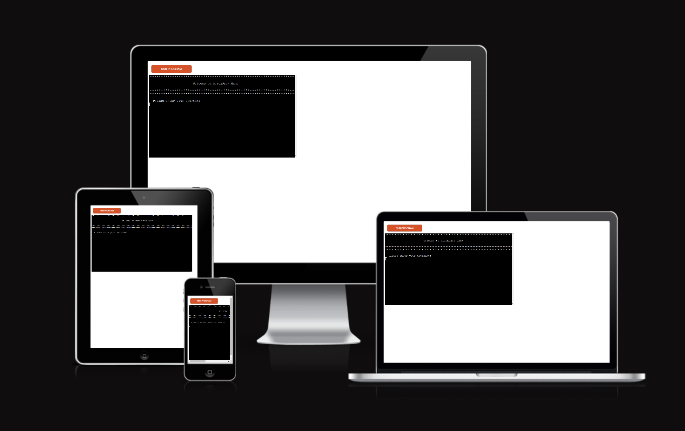

# **BlackJack Game**

## This is a [Blackjack game](),

<p> This is a Blackjack game and is targeted for anyone that may want to challenge the dealer
<p> The objective here is to beat the dealer
<p> By obtaining 21 points or as close as possible to it
<p> If you get more than 21 points, you bust.
<br>



[Blackjack game on Am I Responsive](https://ui.dev/amiresponsive?url=https://blackjack-game20-2cd616944bfc.herokuapp.com/)

---

## **Content**

- [**BlackJack Game**](#blackjack-game)
  - [User Experience](#user-experience)
  - [Design](#design)
    - [Typography](#typography)
    - [Features](#features)
      - [Game]()
  - [Programs and tools used](#programs-and-tools-used)
  - [Languages](#languages)
    - [Python](#python)  
  - [Accessibility](#accessibility)
    - [Lighthouse](#lighthouse)
      - [Desktop Page](#desktop-page)
      - [Mobile Page](#mobile-page)  
  - [Testing](#testing)
  - [Bugs](#bugs) 
  - [Deployment](#deployment)
  - [Credits](#credits)
    - [Content](#content-1)
    - [Media](#media)  

  - [Acknowledgments](#acknowledgments)

---

## **User Experience**

Visitors:

- 
- 
- 

Goals:

- 
- 
- 
- 

The website:

- 
- 
    - 
    - 
    - 
    - 
    - 
    - 
- 
    - 
    - 
    - 
    - 
- 
    - 
    - 
    - 
    - 
- 
- 

[Back to the top](#blackjack-game)

---

## **Design**

### Typography

Fonts used came from []():

- []()
- []()

Colours used:

- 

  
<br>

[Back to the top](#blackjack-game)

---

### Features


  <br>

- #### Main Menu Container

    - 
    - 
    - 
      - 
      - 
      - 
      - 
      -  
      <br>

      

 

[Back to the top](#blackjack-game)

---

## Programs and tools used

- [Codeanywhere](https://app.codeanywhere.com/) - To create the website.
- [Github](https://github.com/) - Where the website is stored.
- [Am I Responsive?](https://ui.dev/amiresponsive) - To display the website on different websites.
- [Spell Check](https://chrome.google.com/webstore/detail/webpage-spell-check/mgdhaoimpabdhmacaclbbjddhngchjik/related) - To check spelling.
- [Google Tools](https://developer.chrome.com/docs/devtools/) - to check website styling and responsiveness.
- [Gyazo](https://gyazo.com/) - To take Screenshots.
- [CI Python Linter](https://pep8ci.herokuapp.com/#) - To check for python code errors

[Back to the top](#blackjack-game)

---

## Languages

- ### Python

  - Python code passes with no errors when checked on CI Python Linter

    - run.py page - PASS
      
    <br>


[Back to the top](#blackjack-game)

---

## Accessibility

I :

- 
- 
- 
- 
- 
- 


[Back to the top](#blackjack-game)

---

## Testing

- 
  - 
  - 
  - 
  - 
- 
  - 
  - 
  - 
  - 
  - 
  - 
- 
- 
- 
- 
 <br>

[Back to the top](#blackjack-game)

---

### Username

| Feature | Expected Outcome | Testing | Result | Pass or Fail |
| --- | --- | --- | --- | --- |
|  |  |  |  |  |

 <br>

[Back to the top](#blackjack-game)

---

## Bugs

- 
    - 
- 
    - 
- 
  - 
- 
  - 
  <br>

[Back to the top](#blackjack-game)

---
 
## Deployment

### My Deployment

- The website was deployed to Github pages. Steps to deploy:  

1. Open Github
2. Log in into your Github account. 
3. In the Github repository select the project. 
4. Navigate to the settings tab. 
5. Then scroll down and on your left select Pages. 
6. Go to branch, and select master branch. 
7. Once master branch is selected, wait a moment and it will provide a page link to the website.  
<br>
  
- The live link can be found here - [My Website]().
  <br>

### Local Deployment

#### Fork the repository

  1. Open Github.
  2. Log in or Sign up.
  3. Look for my repository []().
  4. Last on the right corner you will find the fork button(click on it).

#### Clone the repository
  1. Open Github
  2. Log in or Sign up
  3. Look for my repository []()
  4. Look for code button next to the gitpod button at the top right(click on it).
  5. A window will pop up with options for you to select to clone it with such as HTTPS, SSH or GitHub CLI.
  6. Once selected copy the link that is shown.
  7. Open your code editor terminal.
  8. Type ```git clone``` in the terminal and paste the copied repository link.
  9. After all that just Press enter to create the clone.


[Back to the top](#blackjack-game)

---

## Credits

- ### Content

    - 
      - []()
      
    - 
      - []()
      
    - I have used Readme structure from my first project as a template.

  <br>

- ### Media

  - Websites used-

    - []()
    - []()


[Back to the top](#blackjack-game)

---

## Acknowledgments

- 
- 
- 

[Back to the top](#blackjack-game)