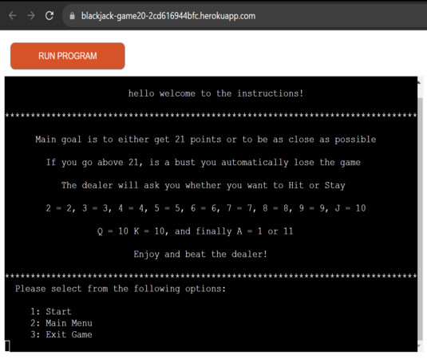

# **BlackJack Game**

## This is a [Blackjack game](),

<p> This is a Blackjack game and is targeted for anyone that may want to challenge the dealer
<p> The objective here is to beat the dealer
<p> By obtaining 21 points or as close as possible to it
<p> If you get more than 21 points, you bust.
<br>


[Blackjack game on Am I Responsive](https://ui.dev/amiresponsive?url=https://blackjack-game20-2cd616944bfc.herokuapp.com/)

---

## **Content**

- [**BlackJack Game**](#blackjack-game)
  - [User Experience](#user-experience)
  - [Design](#design)
    - [Typography](#typography)
    - [Features](#features)
      - [Game]()
  - [Programs and tools used](#programs-and-tools-used)
  - [Languages](#languages)
    - [Python](#python)  
  - [Accessibility](#accessibility)
    - [Lighthouse](#lighthouse)
      - [Desktop Page](#desktop-page)
      - [Mobile Page](#mobile-page)  
  - [Testing](#testing)
  - [Bugs](#bugs) 
  - [Deployment](#deployment)
  - [Credits](#credits)
    - [Content](#content-1)
    - [Media](#media)  
  - [Acknowledgments](#acknowledgments)  

---

## **User Experience**

Visitors:

- Users will be presented with a Blackjack game, which is running on Heroku
- The instructions are provided to help understand the game
- Colours have been added to help distinguish the winner and loser

Goals:

- The player will have to beat the dealer in order to win
- You are suppose to have a BLackjack = 21 points or to have as close as possible to 21 points to beat the dealer
- If you lose play again to beat the dealer
- The main goal is to have fun :)

The game:

- Starting at the beginning with a page asking you to type your username
- After entering your username, it will take you to a main menu with two options:
    - INSTRUCTIONS -  to take you to the instructions menu
    - START - to start the Blackjack game  
- If you select the instructions it will take you to another menu where instructions are displayed and two options to select:
    - START - to start the game
    - EXIT - to take you back to main menu  
- Once you start the game the dealer will give you and himself two cards, the second card from the dealer will be hidden until the game is over
- The gamne will check for Blackjacks, if there is no Blackjack the game will continue
- Two options will be displayed:
    - HIT - to request another card
    - STAY - to check results
- If you have selected Hit, the game will check for winners, if there is no winner the two options will be displayed again
- If you select Stay, the game will check for winners.
- Once the game is over two options will appear:
    - MAIN MENU - to take you back to main menu
    - PLAY AGAIN - to start a new game :)

[Back to the top](#blackjack-game)

---

## **Design**

### Typography

Colours used:

- Colours used are GREEN and RED, they were imported from colorama
```
import colorama
from colorama import Fore
colorama.init(autoreset=True)
```
- In order to work had to install it and freeze requirements.txt
```
pip3 install colorama
```
```
pip freeze > requirements.txt
```

<br>

[Back to the top](#blackjack-game)

---

### Features


  <br>

- #### Username Container

    - Welcome message displayed to the player
    - Username requested in order to progress
      <br>

      

- #### Main Menu Container

    - Welcome message displayed to the player
    - Two options displayed for the user to select
        - Instructions
        - Start
      <br>

      

- #### Instructions Container

    - Instructions displayed for the player to help understand the game
    - Two options displayed for the user to select
        - Start
        - Exit
      <br>

      

- #### Blackjack game Container

    - The game starts and two cards are given to the player and dealer
    - Two options displayed for the user to select
        - Hit
        - Stay
      <br>

      

- #### Game is Over Container

    - Once the game is over, the winner is annouced
    - Two options displayed for the user to select
        - Main Menu
        - Play Again
      <br>

      

 

[Back to the top](#blackjack-game)

---

## Programs and tools used

- [Codeanywhere](https://app.codeanywhere.com/) - To create the website.
- [Github](https://github.com/) - Where the website is stored.
- [Am I Responsive?](https://ui.dev/amiresponsive) - To display the website on different websites.
- [Spell Check](https://chrome.google.com/webstore/detail/webpage-spell-check/mgdhaoimpabdhmacaclbbjddhngchjik/related) - To check spelling.
- [Google Tools](https://developer.chrome.com/docs/devtools/) - to check website styling and responsiveness.
- [Gyazo](https://gyazo.com/) - To take Screenshots.
- [CI Python Linter](https://pep8ci.herokuapp.com/#) - To check for python code errors

[Back to the top](#blackjack-game)

---

## Languages

- ### Python

  - Python code passes with no errors when checked on CI Python Linter

    - run.py page - PASS
      
    <br>


[Back to the top](#blackjack-game)

---

## Accessibility

I :

- 
- 
- 
- 
- 
- 


[Back to the top](#blackjack-game)

---

## Testing

- 
  - 
  - 
  - 
  - 
- 
  - 
  - 
  - 
  - 
  - 
  - 
- 
- 
- 
- 
 <br>

[Back to the top](#blackjack-game)

---

### Username

| Feature | Expected Outcome | Testing | Result | Pass or Fail |
| --- | --- | --- | --- | --- |
|  |  |  |  |  |

 <br>

[Back to the top](#blackjack-game)

---

## Bugs

- 
    - 
- 
    - 
- 
  - 
- 
  - 
  <br>

[Back to the top](#blackjack-game)

---
 
## Deployment

### My Deployment

- The website was deployed to Github pages. Steps to deploy:  

1. Open Github
2. Log in into your Github account. 
3. In the Github repository select the project. 
4. Navigate to the settings tab. 
5. Then scroll down and on your left select Pages. 
6. Go to branch, and select master branch. 
7. Once master branch is selected, wait a moment and it will provide a page link to the website.  
<br>
  
- The live link can be found here - [My Website]().
  <br>

### Local Deployment

#### Fork the repository

  1. Open Github.
  2. Log in or Sign up.
  3. Look for my repository []().
  4. Last on the right corner you will find the fork button(click on it).

#### Clone the repository
  1. Open Github
  2. Log in or Sign up
  3. Look for my repository []()
  4. Look for code button next to the gitpod button at the top right(click on it).
  5. A window will pop up with options for you to select to clone it with such as HTTPS, SSH or GitHub CLI.
  6. Once selected copy the link that is shown.
  7. Open your code editor terminal.
  8. Type ```git clone``` in the terminal and paste the copied repository link.
  9. After all that just Press enter to create the clone.


[Back to the top](#blackjack-game)

---

## Credits

- ### Content

    - 
      - []()
      
    - 
      - []()
      
    - I have used Readme structure from my first project as a template.

  <br>

- ### Media

  - Websites used-

    - []()
    - []()


[Back to the top](#blackjack-game)

---

## Acknowledgments

- I would like to thank my mentor Graeme Taylor for helping me along the way in completing my Third milestone project.
- I would like to thank the tutors from Code Institute for helping me solving the issues that I had with the project.
- I also would like to thank my family and friends for helping me with the tests.

[Back to the top](#blackjack-game)